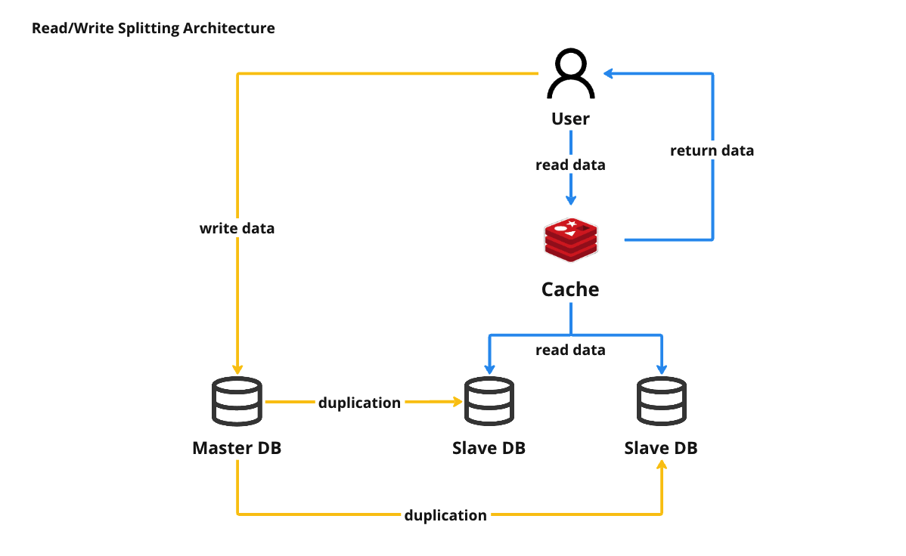
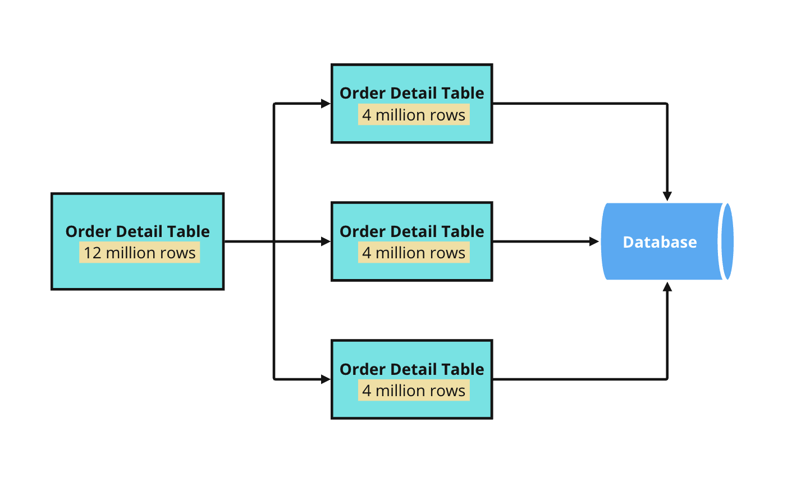
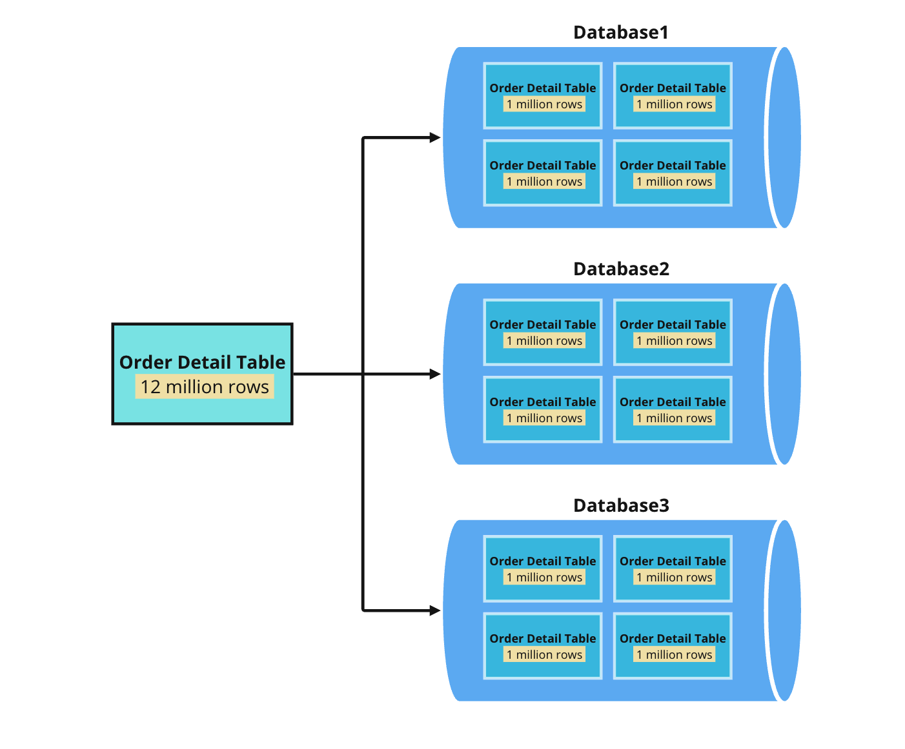
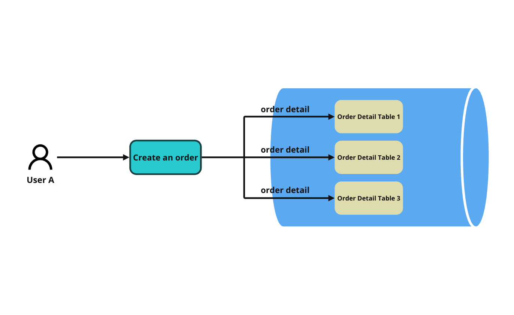
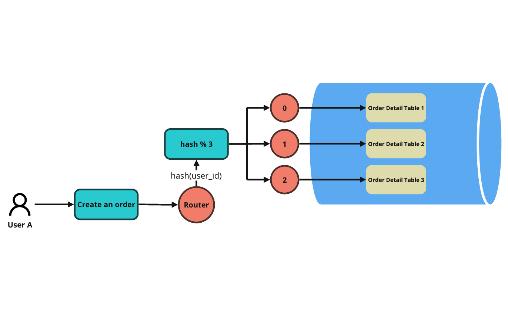
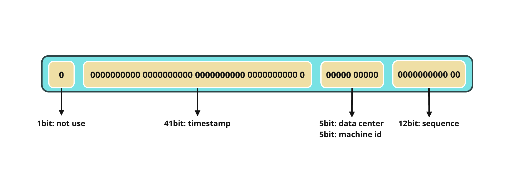

# SQL Database Performance Optimization Step by Step

## Step1 Add Index

Indexes are used in MySQL to find rows with specific column values quickly. Without an index, MySQL must begin with the first row and then read through the entire table to find the relevant rows, which is inefficient for large datasets.

### Table Design

Table 1: `order_info`

| Field                  | Data Type      | Description                      |
| ---------------------- | -------------- | -------------------------------- |
| id                     | BIGINT         | Auto-incremented primary key     |
| order_no               | VARCHAR(255)   | Order number                     |
| order_amount           | DECIMAL(10, 2) | Order amount                     |
| order_freight          | DECIMAL(10, 2) | Order freight                    |
| order_status           | INT            | Order status                     |
| trans_time             | DATE           | Transaction time                 |
| pay_status             | BIGINT         | Payment status                   |
| merchant_id            | BIGINT         | Merchant ID                      |
| user_id                | BIGINT         | User ID                          |
| recharge_time          | DATE           | Recharge time (Date of recharge) |
| pay_discount_amount    | DECIMAL(10, 2) | Payment discount amount          |
| pay_amount             | DECIMAL(10, 2) | Amount paid                      |
| address_id             | BIGINT         | Address ID                       |
| remark                 | VARCHAR(255)   | Remark                           |
| delivery_type          | BIGINT         | Delivery type                    |
| delivery_status        | BIGINT         | Delivery status                  |
| delivery_expect_time   | DATE           | Expected delivery time           |
| delivery_complete_time | DATE           | Delivery completion time         |
| delivery_amount        | DECIMAL(10, 2) | Delivery amount                  |
| buyer_status           | BIGINT         | Buyer status                     |
| coupon_id              | BIGINT         | Coupon ID                        |

Table 2: `order_item_detail`

| Field           | Data Type      | Description                  |
| --------------- | -------------- | ---------------------------- |
| id              | BIGINT         | Auto-incremented primary key |
| order_no        | VARCHAR(255)   | Order number                 |
| product_id      | BIGINT         | Product ID                   |
| category_id     | BIGINT         | Category ID                  |
| goods_num       | DECIMAL(10, 2) | Number of goods              |
| goods_price     | DECIMAL(10, 2) | Price per unit               |
| goods_amount    | DECIMAL(10, 2) | Total goods amount           |
| discount_amount | DECIMAL(10, 2) | Discount amount              |
| discount_id     | BIGINT         | Discount ID                  |

### Generate Data

Use Python script with faker lib to generate a hundred thousand rows for the two tables.

```python
import random
import decimal
from faker import Faker
import datetime
import pymysql

# Set the number of records to generate
num_records = 100000

# Connect to the MySQL database
db = pymysql.connect(
    host="localhost",
    user="root",
    password="",
    database="monomer_order"
)

# Create a cursor to execute SQL queries
cursor = db.cursor()

# Instantiate the Faker library
fake = Faker()

def get_order_no(user_id):
    order_id_key = get_order_id_key(user_id)
    return order_id_key

def get_order_id_key(user_id):
    return '10' + get_date_time_key() + get_auto_no_key() + to_code(user_id)

def get_date_time_key():
    date_time = datetime.datetime.now().strftime("%Y%m%d%H%M%S")
    return date_time

def get_auto_no_key():
    range_start = 10**(6-1)
    range_end = (10**6)-1
    return str(random.randint(range_start, range_end))

def to_code(value):
    return str(value).rjust(4, '0')

# Generate and insert data into the order_info and order_item_detail tables
for _ in range(num_records):
    order_no = get_order_no(fake.random_int(min=0, max=999999999999999999))  # Call the function to generate order_no
    order_amount = decimal.Decimal(random.uniform(100, 10000))
    order_freight = decimal.Decimal(random.uniform(5, 50))
    order_status = random.choice([10, 20, 30, 40, 50, 55, 60, 70])
    trans_time = fake.date_between(start_date="-1y", end_date="today")
    pay_status = random.choice([1, 2])
    merchant_id = fake.random_int(min=0, max=999999999999999999)
    user_id = fake.random_int(min=0, max=999999999999999999)
    recharge_time = fake.date_between(start_date="-1y", end_date="today")
    pay_discount_amount = decimal.Decimal(random.uniform(0, 100))
    pay_amount = decimal.Decimal(random.uniform(100, 10000))
    address_id = fake.random_int(min=0, max=999999999999999999)
    remark = fake.text(max_nb_chars=100)
    delivery_type = random.choice([1, 2])
    delivery_status = random.choice([0, 1, 2])
    delivery_expect_time = fake.date_between(start_date="today", end_date="+1y")
    delivery_complete_time = fake.date_between(start_date="-1y", end_date="today")
    delivery_amount = decimal.Decimal(random.uniform(5, 50))
    buyer_status = random.choice([0, 1, 2, 3])
    coupon_id = fake.random_int(min=0, max=999999999999999999)

    # Insert the generated data into the order_info table
    cursor.execute(
        "INSERT INTO order_info (order_no, order_amount, order_freight, order_status, trans_time, pay_status, merchant_id, user_id, recharge_time, pay_discount_amount, pay_amount, address_id, remark, delivery_type, delivery_status, delivery_expect_time, delivery_complete_time, delivery_amount, buyer_status, coupon_id) VALUES (%s, %s, %s, %s, %s, %s, %s, %s, %s, %s, %s, %s, %s, %s, %s, %s, %s, %s, %s, %s)",
        (
            order_no,
            order_amount,
            order_freight,
            order_status,
            trans_time,
            pay_status,
            merchant_id,
            user_id,
            recharge_time,
            pay_discount_amount,
            pay_amount,
            address_id,
            remark,
            delivery_type,
            delivery_status,
            delivery_expect_time,
            delivery_complete_time,
            delivery_amount,
            buyer_status,
            coupon_id,
        )
    )

    # Generate and insert data into the order_item_detail table
    for _ in range(random.randint(1, 5)):  # Generate 1-5 items for each order
        product_id = fake.random_int(min=0, max=999999999999999999)
        category_id = fake.random_int(min=0, max=999999999999999999)
        goods_num = decimal.Decimal(random.uniform(1, 10))
        goods_price = decimal.Decimal(random.uniform(10, 100))
        goods_amount = goods_num * goods_price
        discount_amount = decimal.Decimal(random.uniform(0, 10))
        discount_id = fake.random_int(min=0, max=999999999999999999)

        # Insert the generated data into the order_item_detail table
        cursor.execute(
            "INSERT INTO order_item_detail (order_no, product_id, category_id, goods_num, goods_price, goods_amount, discount_amount, discount_id) VALUES (%s, %s, %s, %s, %s, %s, %s, %s)",
            (
                order_no,
                product_id,
                category_id,
                goods_num,
                goods_price,
                goods_amount,
                discount_amount,
                discount_id,
            )
        )

# Commit the changes and close the database connection
db.commit()
cursor.close()
db.close()
```

### Without an index

```sql
SELECT order_info.order_no, order_info.user_id, order_item_detail.*
FROM order_info
LEFT JOIN order_item_detail
ON order_info.order_no = order_item_detail.order_no
WHERE order_info.user_id = 403069986843429898;
```

**The duration is: 0.215 sec / 0.000010 sec≈ 21500 ms.**

MySQL has to use a full table scan, which requires going through every row of the table one by one to find the matching rows. This operation has a time complexity of **O(n)**, where n is the number of rows in the table. This means that the time taken to execute the operation increases linearly with the size of the table.

### With an index

```sql
ALTER TABLE order_info ADD INDEX idx_order_info_user_id (user_id);
ALTER TABLE order_info ADD INDEX idx_order_info_order_no (order_no);
ALTER TABLE order_item_detail ADD INDEX idx_order_item_detail_order_no (order_no);
```

- **`user_id`** in **`order_info`** table: This could speed up filtering operations based on the **`user_id`**.
- **`order_no`** in both **`order_info`** and **`order_item_detail`** tables: These could speed up the join operation between these two tables.

With this index in place, run the same query:

```sql
SELECT order_info.order_no, order_info.user_id, order_item_detail.*
FROM order_info
LEFT JOIN order_item_detail
ON order_info.order_no = order_item_detail.order_no
WHERE order_info.user_id = 403069986843429898;
```

**The duration is: 0.00070 sec / 0.000016 sec≈ 43.75 ms.**

**Performance Improvement Percentage ≈ 99.99674%**

When an index is available, MySQL tends to use B-tree index. In a B-tree index, data is stored in a tree-like structure where each node is sorted. This allows MySQL to use a process similar to a binary search, which significantly reduces the number of operations needed to find a match. The search operation has a time complexity of **O(log n)**, where n is the number of entries in the index.

PS: The storage engine used here was InnoDB.

## Step2 Introduce Redis as cache

Although the use of index improves the query speed of mysql, a large number of requests to access MySQL during peak hours will cause the MySQL server to respond too slowly.


In order to reduce the burden on the MySQL server, Redis is introduced as a cache. In order to make Redis achieve the desired effect, it is necessary to improve the cache hit rate as much as possible.

### Strategies to Enhance Cache Hit Rate

#### 1. Identifying Appropriate Business Scenarios

Cache systems are highly effective in scenarios where read operations significantly outnumber write operations, preferably in high-frequency access scenarios. 

#### 2. Setting the Cache Capacity Judiciously

Proper cache size allocation is vital for its optimal functioning. If the cache capacity is set too low, it will frequently trigger Redis's memory eviction mechanism, leading to key deletions and thereby neutralizing the caching effect.

#### 3. Fine-tuning Cache Expiration Time

Precise calibration of cache expiration time can prevent simultaneous invalidation of keys, which could otherwise lead all requests straight to the database, causing a cache breakdown. An incorrect expiration time setting can significantly impact cache performance.

#### 4. Mitigating Cache Penetration

When querying data, the initial check should be from the Redis cache. If not found, the database should be queried. In case the data is absent in both places, it can lead to cache penetration.

If a high volume of such requests is received, and the data is not available either in Redis or in the database, it could trigger a cache avalanche, potentially leading to a service crash.

To prevent this, an empty object can be set in the cache for such query requests, effectively returning an empty object to the requester.

#### 5. Implementing Cache Warm-Up

To enhance cache hit rate, the practice of "warming up" the cache can be employed. This process involves pre-loading relevant data from the database into the Redis cache. Thus, when a query is made for the first time, the data can be directly fetched from the cache, resulting in faster response times.

## Step3 Read/Write Splitting




## Step4 Database Table Horizontal Sharding and Partitioning

In Step 3, we improved the performance of data retrieval by implementing the master-slave mode. However, we have yet to find a solution to enhance the writing capability of the primary database. Therefore, in this phase, I propose horizontally sharding and partitioning the tables in the database to improve the performance of data insertion.

#### 1. Horizontal Sharding



#### 2. Horizontal Partitioning


#### 3. Horizontal Sharding and Partitioning



Horizontal sharding and partitioning offer the advantages of increased parallelism, reduced contention, improved scalability, targeted optimization, and workload isolation, resulting in optimized write performance. By distributing data across multiple shards or partitions, concurrent writes can be achieved, minimizing contention for system resources, and enabling linear scalability. Each shard or partition can be optimized individually, allowing for tailored indexing and performance optimizations, while workload isolation prevents write-intensive operations from impacting other critical processes. 

## Step4 Router Policy and Global ID in a Multi-Database and Multi-Table Environment

### Scenarios for Multi-Table Queries


After an order is created, from the user's perspective, there is a need to query the order and check its status. From the merchant's perspective, there is a requirement to retrieve order information and analyze the orders.



However, in a multi-table environment, when a user places an order, the created orders may be stored in different tables, requiring queries to involve multiple tables.

Therefore, to improve query efficiency, it is necessary to establish a routing rule that ensures orders created by the same user are stored in the same table as much as possible.

### Router Policy for User (toC)

#### 1. Start from a Multi-table environment



Since the user_id is unique, it can be used as the routing key in this scenario. When a user places an order and the order is generated, the user_id is hashed, and then the resulting value is used to perform modulo operation with the number of tables. This ensures that the order information for the same user is stored in the same table.

#### 2. Expand to a Multi-database and Multi-table environment

Following the previous approach, first locate the database containing the order information, and then find the corresponding table within it.


User places an order -> Generate an order -> Use the hash value of user_id to perform modulo operation with the number of databases to locate the corresponding database -> Divide the hash value of user_id by the number of tables and perform modulo operation to locate the corresponding table.

### Router Policy for Merchant (toB)

The merchant should be able to retrieve the corresponding user's order information. However, the merchant should not use user_id as the routing key. This is not reasonable.

Therefore, from the user's perspective, use user_id as the routing key. From the merchant's perspective, use merchant_id as the routing key.。


Introduce RocketMQ as the message queue. When a user places an order, the order number is sent to the MQ. The merchant consumes this MQ message, retrieves the order information based on the order number, and then inserts the order information into the user's database.

### Generate globally unique IDs for order table

Introduce the SnowFlake algorithm.



Snowflake algorithm can generate globally unique order IDs based on different servers and timestamps.

[Learn more about Snowflake Algorithm](https://github.com/oliverXS/snowflake-algorithm-java)

### Optimize the Scalability of Database Servers

Introduce consistent hash algorithm to replace the hash algorithm for the fixed number of servers.

[Learn more about Consistent Hashing](https://github.com/oliverXS/consistent-hashing-java)


#### 1. Data migration

Set the database server on a hash ring of length 2^32 -1. When the server increases or decreases, the amount of data that needs to be migrated is greatly reduced.

#### 2. Load balancing

Introduce virtual nodes on the hash ring to ensure load balancing and avoid a large number of requests to access the same server.
